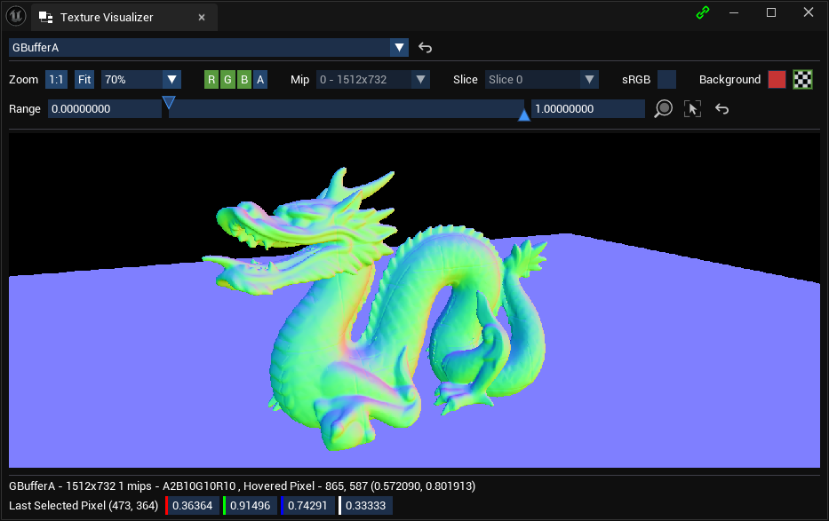
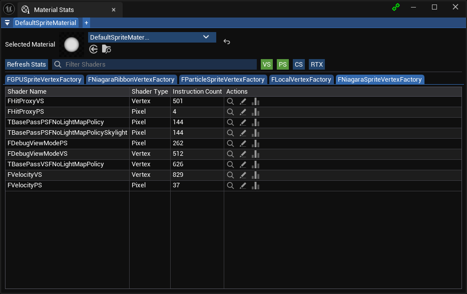
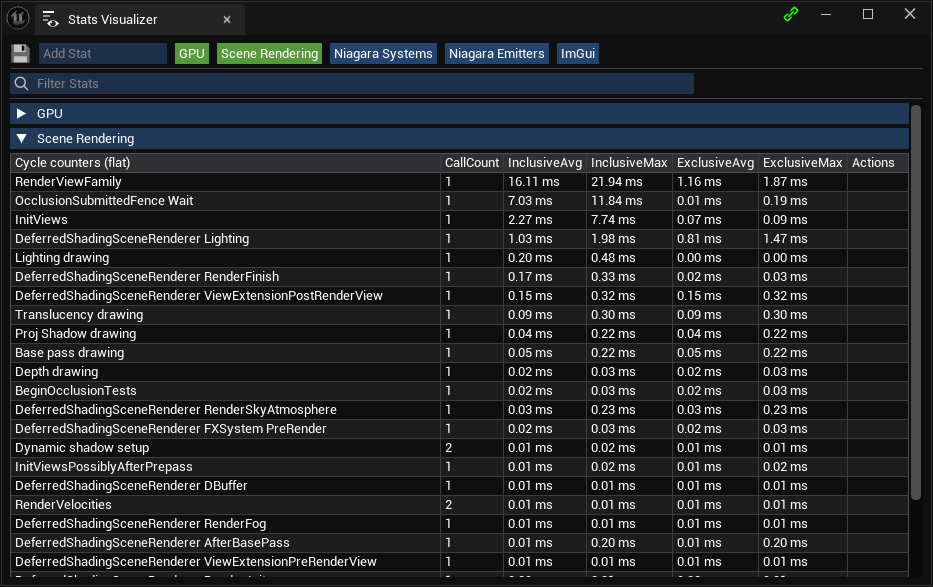
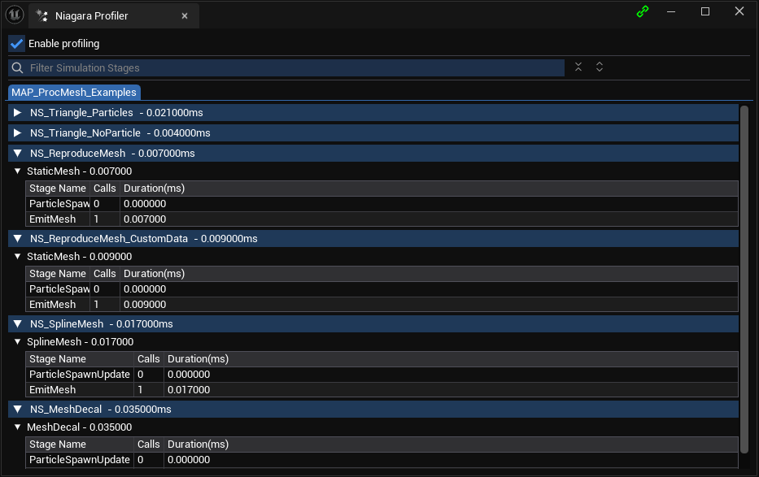
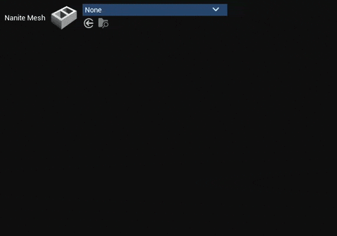
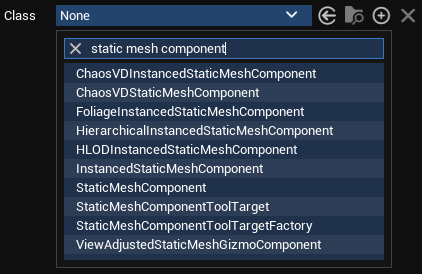

# ImGuiWidgets
A collection of tools and widgets using [ImGui](https://github.com/amuTBKT/ImGuiPlugin) plugin.

## Installation
* Follow the [steps](https://github.com/amuTBKT/ImGuiPlugin#installation) to enable ImGuiPlugin.
* Clone the repo in Project/Plugins folder `git clone git@github.com:amuTBKT/ImGuiWidgets.git` <br>
  or download zip and extract under Project/Plugins folder.
* Enable the plugin in your uproject.

Widgets
- [Asset Picker](#asset-picker)
- [Class Picker](#class-picker)

Tools
- [Texture Visualizer](#texture-visualizer)
- [Material Stats](#material-stats)
- [Stats Visualizer](#stats-visualizer)
- [Niagara GPU Profiler](#niagara-gpu-profiler)

### Texture Visualizer
Tool for inspecting render graph textures. Very much inspired and based on RenderDoc's texture viewer.<br>

Texture visualizer allows setting texture from code which can be useful to view textures not accessible through render graph.
```cpp
#include "ImGuiTextureVisualizer.h"

// for inspecting UTexture assets
ImGuiTextureVisualizer::SetTextureOverride_GameThread(TextureAsset);

// for inspecting texture resource
ImGuiTextureVisualizer::SetTextureOverride_GameThread("MyResource", TextureResource);

// for inspecting RHI texture
ImGuiTextureVisualizer::SetTextureOverride_RenderThread("MyTexture", TextureRHI);

```

### Material Stats
Tool for inspecting UMaterial shader stats. Allows viewing shader code for every vertex factory + compute/pixel shader combinations.<br>


### Stats Visualizer
Alternative to Unreal's `stat` command. Shows the stats in a separate window with filtering support.<br>


### Niagara GPU profiler
Tool for displaying Niagara simulation stage duration. Useful when optimizing simulation stages.<br>


### Asset picker
`SAssetPicker` widget for ImGui.<br>

```cpp
// asset tag to filter meshes with Nanite flag enabled.
FImGuiAssetTagFilter NaniteAssetFilter =
{
  .TagName = TEXT("NaniteEnabled"),
  .ExpectedValue = TEXT("True")
};

// creates a widget which accepts StaticMesh assets + applies the nanite asset filter
static FImGuiAssetPicker StaticMeshPicker = 
  FImGuiAssetPicker::MakeWidget(UStaticMesh::StaticClass())
  .AddFilter(NaniteAssetFilter);

static TWeakObjectPtr<UStaticMesh> StaticMeshPtr = nullptr;
if (StaticMeshPicker.Draw(Context, "Nanite Mesh", StaticMeshPtr))
{
  // process mesh
}

// NOTE: AddFilter() can be chained when constructing the widget or use EnableFilter/DisableFilter to toggle behaviour at runtime
```

### Class picker
Class picker widget for ImGui.<br>

```cpp
// creates a widget which accepts any UObject class
static FImGuiClassPicker ClassPicker = FImGuiClassPicker::MakeWidget(UObject::StaticClass());

// enable filter to show only classes of specified type
ClassPicker.EnableFilter(FImGuiAllowedClassFilter(UMyCustomClass::StaticClass()));

// enable interface requirement
ClassPicker.EnableFilter(FImGuiRequiredInterfaceFilter(FSoftClassPath("CLASS_PATH")));

// NOTE: AddFilter() can be chained when constructing the widget or use EnableFilter/DisableFilter to toggle behaviour at runtime
```
